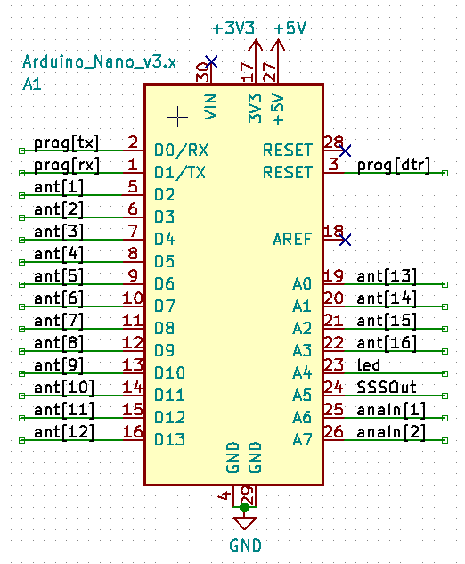

# aREAS - a REST-API External Antenna Switch

This project aims to create simple and efficient way to control
antenna switches via TCP/IP network, either via Ethernet cable or WiFi network.

Depending on configuration commands recieved via internet can be 
executed as GPIO actions, or may be sent via different medium, like
very slow serial output sent using the same medium as RF signal.

~~The project is based on aREST library to provide HTTP REST API.~~

_Sadly aREST library doesn't work with the cheapo ethernet sheld from
aliexpress, so a library compatible with standard ethernet.h is used,
and only basic http request handling is supported._ 

## Hardware platform
In order to simplify the hardware part, only two platforms will be served:

-Arduino nano (with atmeg328p) + cheap aliexpress nano ethernet shield  
-[TODO] ESP8266 WiFi-enabled chip with optional I2C I/O Extender for 9+ antennas

In the final version pin functions should look something like this:

## Implemented API
What is REST API? It's the way to send request via http protocol, the same
that's used in your browser adress bar. This video sums it up pretty well:
https://www.youtube.com/watch?v=7YcW25PHnAA

General driver's API implements these functions:

The query for switching between single antennas:
aREAS1.local/?ant={0-16}  //0 - off, 1;16 - ant number

The query for turning on multiple antenna configurations:
aREAS1.local/?mul=xxxxxxxxxxxxxxxx //x = 0 or 1, 1;16 x'es

Get current antenna config (and maybe more in the future)
aREAS1.local/?sta

Programmer familiar with Arduino IDE may also implement
their own functionality, using "attachCallback()" method,
as seen in example "Ethernet_custom". In this case the
query is as follows:

aREAS1.local/?com={command} //for example "?UHF" or "?flt=1"

Custom commands are attachable in setup() loop and can either
access GPIO controlled by aREAS driver, or even implement it's own
functionality (like controlling external bandpass filter or 
reading some analog value).

## General usage
The device may be served directly from the browser window, but
generally it's meant to be controlled by an external application.

In order to test the API, a simple client has been written in html+js. 
Yes, javascript can access devices in LAN. I was suprised too. The client 
can be found in /tests directory, you can give it a try under [**this link**](http://htmlpreview.github.io/?https://github.com/critBit95/aREAS/blob/master/tests/API_Tester.html).

## TODO list:
Arduino:
- [x] create working Ethernet example
- [x] populate aREAS.h and antController.h files
- [ ] DHCP functionality
- [ ] create working WiFi example
- [ ] adapt aREAS.h and antController.h to work with both Ethernet and WiFi

Testing/clients:
- [ ] create python tests
- [x] create simple html5+js test client
- [ ] create touch-enabled smartphone/tablet client

Hardware:
- [x] create SimpleSlowSerial library for sending data with baudrates
    under 300bps (preferably 50bps) parallel to RF signals;
- [ ] include schematics
- [ ] synchronize antController.h with schematics
- [ ] include motherboard file
- [ ] create daughterboard for ESP8266 with pin layout identical 
    to arduino nano

Stuff:
- [ ] installation instructions
- [ ] deal with license stuff
- [ ] inviting to cooperation when project actually looks decent 

Copyright lololol Jakub Sadowski coffeeware placeholder license
